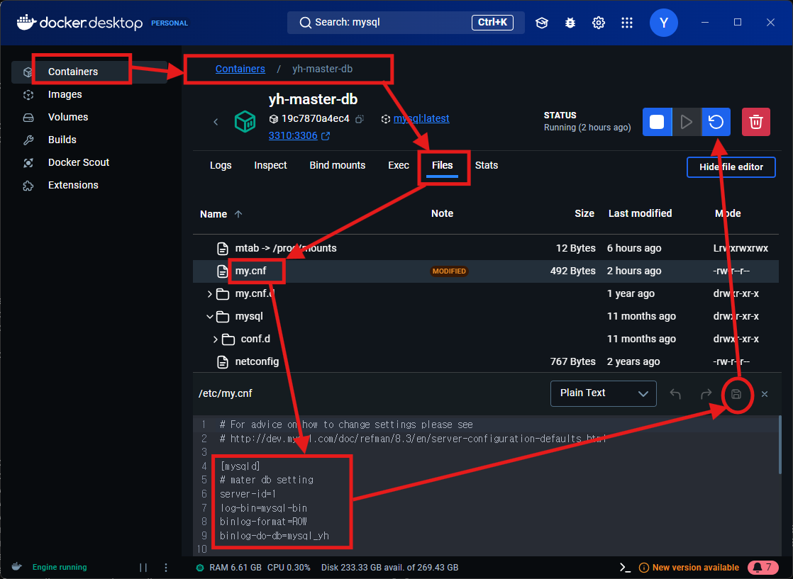
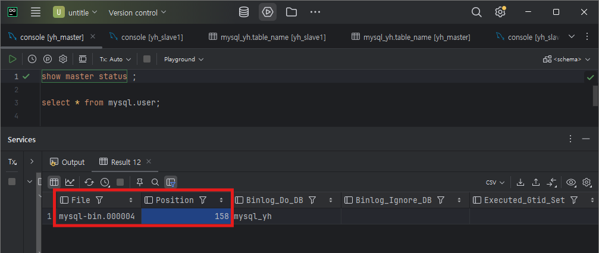

# MYSQL 마스터-슬레이브 구조 만들기
> 개요
> 1. MYSQL DB를 가지고 마스터 슬레이브 구조를 만드는 이유
> 2. 구축에 필요한 환경
> 3. 구축하기

---
## 1. MYSQL 마스터 슬레이브 구조를 만드는 이유
`문제` >   
대규모 트레픽을 자세히 보면 데이터값을 변경하는 요청보다 데이터를 조회하는 요청이 더 많다.  
그런데 DB 하나로 모든 요청을 다 처리하기에는 벅차고 DB가 뻣을 수 있다.
이를 어떻게 해결할까?  
  
`해결` >  
데이터를 수정하는 요청은 한곳으로 몰고,  
조회요청은 원본 데이터베이스를 복제한 레플리카 DB에 넘기자!  

수정요청을 담당하는 곳을 마스터 DB라 산정하고,  
이 마스터DB를 복제한 DB를 슬레이브라고 산정하자.  

모든 조회 요청은 슬레이브DB들에게 주어 로드밸런싱하게 하고   
데이터 삽입, 수정 삭제 요청은 마스터 DB로 가게 처리하면
요청이 분산되어 원본DB에 부하를 줄일 수 있다.

또 원본DB가 고장났을 경우, 백업용 및 마스터 DB로 승격시켜서  
데이터 베이스 이슈를 빠르게 대응할 수 있다.

---
## 2. 구축에 필요한 환경
>   - DockerDesktop
  
`이유` >   
내 컴퓨터가 여러대를 가지고 있는게 아니니 `컨테이너 기술`을 이용해서 구축할 것!  
네트워크로 연결시켜야하는 데 `docker network` 사용하면 쉽게 내부망을 만들 수 있음

---
## 3. 구축하기
### DockerDesktop으로 빠르게 MYSQL 컨테이너 생성 (mysql 서버 생성)
  
- `DockerDesktop`를 다운받는다  
(mysql 설정 파일을 수정해야되는 데 mysql 이미지의 쉘에는 텍스트 편집기가 없어서 불편함 )
  

- **docker 네트워크 생성**  
    ```shell
    docker network create ms-network
    ```  
  `설명` >   
  네트워크를 만들어주는 명령어로 물리적으로 생각해보면 `공유기`나 `스위치`등을 설치한다 생각하면 편함
  

- **mysql 컨테이너 생성 + 네트워크 연결**
  - **마스터 DB 생성**
    ```shell
    docker run -d -p 3310:3306 --name mysql-master --network ms-network -e MYSQL_ROOT_PASSWORD=12345678 mysql:latest
    ```  
    `설명` >  
    `-p 3310:3306` : 로컬에서 해당 DB에 접속하기 위해 로컬 포트와 컨테이너의 포트 연결  
    `--name mysql-master` : 컨테이너 이름, 나중에 네트워크에서 연결할때 IP 대신 사용  
    `--network ms-network` : 위에서 생성한 네트워크에 해당 컨테이너를 연결  
    `-e MYSQL_ROOT_PASSWORD=12345678` : 환경변수로 mysql에 root계정 비밀번호 설정  
    `mysql:latest` : 컨테이너로 올릴 이미지, mysql 최신 버전으로 컨테이너 생성  
    <hr/>
  
  - **슬레이브 DB 생성**
    ```shell
    docker run -d -p 3311:3306 --name mysql-slave1 --network ms-network -e MYSQL_ROOT_PASSWORD=12345678 mysql:latest
    docker run -d -p 3312:3306 --name mysql-slave2 --network ms-network -e MYSQL_ROOT_PASSWORD=12345678 mysql:latest
    ```  
    `설명` >  
    mysql 서버를 증설한다 생각하면됨, 다만 내 PC에서 동작하니까 포트값을 다르게 해서 올리기!  
    `-p 3311:3306`,`-p 3312:3306`  
    docker network에서 컨테이너명으로 식별가능하니 컨테이너 명도 신경쓰기  
    `--name mysql-slave1`, `--name mysql-slave2`
    <hr/>
    
 - 컨테이너들에 접속해서 mysql 설정 추가하기  
   1. `DockerDesktop`에서 위에서 만들어준 컨테이너 클릭
   2. `Files`탭에서 /etc/`my.cnf` 를 찾아 `우클릭`
   3. `[mysqld]` 아래에 밑에 내용을 추가후, 저장  
      ```shell
        # mater db setting
        server-id=1 # 서버 식별 id값으로 고유한 값을 넣어줌 필자는 master=1,slave1=2, ..
        log-bin=mysql-bin  # mysql은 log파일을 확인해서 내용을 복제함 그때 쓰이는 경로
        binlog-format=ROW
        binlog-do-db=데이터베이스_스키마명 # log를 가지고 복제할 db명,
      ```
   4. 컨테이너 재시작하기
   
   > [요약]
   
   
- mysql에 접속해서 MASTER SLAVE 설정
  - 마스터 DB 설정 및 슬레이브용 계정 생성 
      ```sql
    --슬레이브DB용 계정 생성
    CREATE USER 'slave'@'%' IDENTIFIED BY '12345678';
    GRANT REPLICATION SLAVE ON *.* TO 'slave'@'%';
    FLUSH PRIVILEGES;
    --마스터DB 상태 값 조회
    SHOW MASTER STATUS;
      ```
    위에서 조회한 마스터DB 상태값 중 position, File 필드를 따로 기억해놓기
  
  - 슬레이브 DB 설정
    ```sql
    CHANGE MASTER TO
      MASTER_HOST='마스터DB 컨테이너 명', # 도커 네트워크 기능으로 ip가 아닌 이름으로 가능 
      MASTER_USER='slave',
      MASTER_PASSWORD='12345678',
      MASTER_LOG_FILE='mysql-bin.000001', # 마스터에서 확인한 File 필드 값
      MASTER_LOG_POS=158; # 마스터에서 확인한 Position 필드 값
                            
    --슬레이브 역할로 실행
    START SLAVE;
                            
    --슬레이브 동작 확인
    SHOW SLAVE STATUS                        
    ```

### 예외상황 대응
- 슬레이브에서 마스터 정보 잘못 입력시
```sql
--CHANGE MASTER TO 잘못입력했을 경우 정지후, 재실행
STOP SLAVE IO_THREAD; # 슬레이브 IO 스레드 정지 명령
START SLAVE;            
```
- DB끼리 통신시 SSL 사용을 기본으로 되어있는 데 이를 해제하는 법
```sql
ALTER USER 'slave'@'%' IDENTIFIED WITH mysql_native_password BY '12345678';
FLUSH PRIVILEGES;
```


