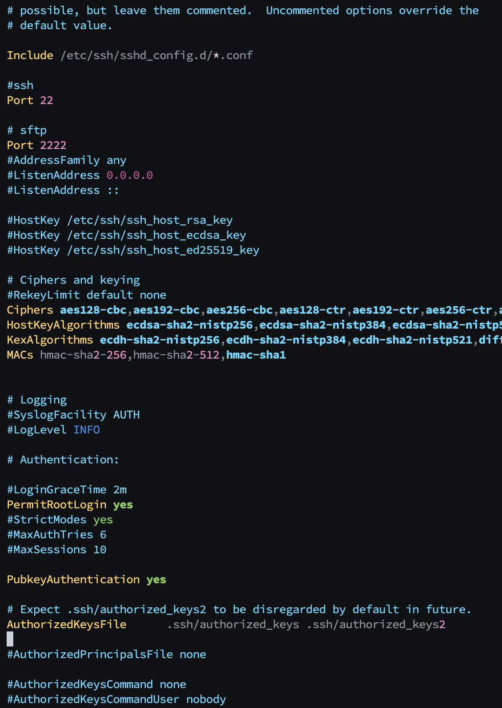
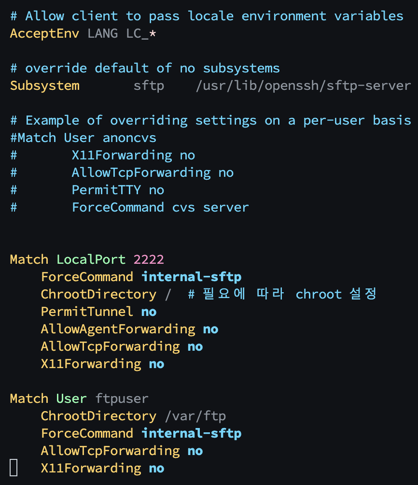

# SSH/SFTP 구축하기
`문서 작업중...`
> 1. 서버환경에 맞게 `ssh 프로그램` 설치
> 2. 설치된 ssh 환경설정 파일 수정 (로그인방식 등등)
> 3. ssh 키생성 및 복사
> 4. 서버환경(`물리서버` or `AWS`/`Cafe24`)에 맞게 방화벽 `22 포트` 개방
> 5. 기타 명령(로그 보기)


## 1. 서버환경에 맞게 `SSH 프로그램` 설치

  ```shell
  #ubuntu 기준
  apt update
  apt install openssh-server
  ```
 ...

## 2. 설치된 SSH 환경설정 파일 수정 (로그인방식 등등)
1. ssh 설정파일 경로 이동  
    ```shell  
    cd /etc/ssh  
    ```  
2. 설정 파일 내용 수정  
    ```shell
    vi sshd_config
    ```
    
    - `Port` : 사용할 포트를 지정할 수 있음
    - `PubkeyAuthentication` : 공개키-개인키 인증 여부
    - `PasswordAuthentication yes` : `아이디/패스워드` 방식으로 로그인할 수 있음

- Match 옵션 설정
  

